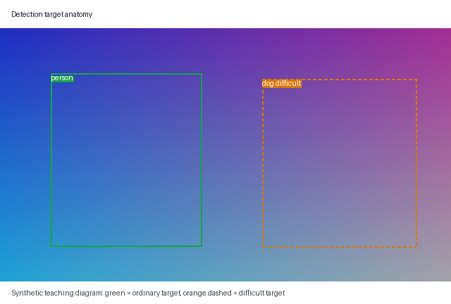

# 教程 02：训练前先确认 VOC 数据可信

[English](02-data-and-boxes.md) | [教程索引](README.zh-CN.md)

本章需要教程 01 中的锁定环境，以及足够的 VOC 2007 本地存储空间。下载需要访问官方
主机；准备、检查和预览都在本地完成。

## 下载两个官方归档文件

```bash
uv run python scripts/download_data.py --data-dir data/raw
```

脚本使用以下官方发布信息：

| 归档文件 | 官方 MD5 |
|---|---|
| `VOCtrainval_06-Nov-2007.tar` | `c52e279531787c972589f7e41ab4ae64` |
| `VOCtest_06-Nov-2007.tar` | `b6e924de25625d8de591ea690078ad9f` |

成功时，标准输出会列出 `data/raw/archives` 下的两个文件，并在
`data/raw/VOCdevkit/VOC2007` 留下解压后的目录树。已有归档只有在校验和正确时才会复用；
若已有归档的校验和不符，脚本会重新下载。若完整传输后的校验和仍不符，命令会失败并删除
对应的 `.part` 文件。不安全的 tar 条目同样会导致硬错误。

## 校验并发布固定的数据清单

```bash
uv run detect prepare-data --data-dir data/raw --manifest-dir data/manifests
```

准备过程会校验官方划分数量（train `2501`、valid `2510`、test `4952`）、图像 ID 是否
互斥、图像与 XML 是否存在、图像能否解码、尺寸是否一致、类别和框是否合法，以及标注
文件名是否匹配。预期标准输出先给出一个 `identity=` SHA-256，再给出三个划分的数量。

命令会整体发布 `train.csv`、`valid.csv`、`test.csv`、`dataset.yaml`、`source.yaml` 和
`summary.txt`。各划分的哈希值包含清单行以及引用图像和 XML 的原始字节；总身份标识还
包含类别顺序与坐标约定。

请把准备目录视为不可变的实验输入。文件系统并未将它设为只读；再次运行准备命令会原子
替换整个目录。若源内容或划分成员发生变化，身份标识也会变化，旧检查点不能被当作
是在新数据上训练或评估。`--allow-nonstandard-counts` 可用于刻意构造的 VOC 格式测试数据，
但这种运行不是官方 VOC 2007 结果。

## VOC 坐标只转换一次

VOC XML 使用从 1 开始、包含端点的角点坐标。解析器按下面规则转成零基连续 `xyxy`：

```text
(xmin - 1, ymin - 1, xmax, ymax)
```

例如，VOC 框 `(11,21,50,70)` 会变为 `[10,20,50,70]`，宽为 `40`、高为 `50`、面积为
`2000`。最大坐标保持不变，因为转换后它们表示连续坐标中的排他边界。解析器会把框裁到
图像范围，并拒绝裁剪后宽或高不为正的框。

后续变换中不要再次减 1，面积也不要再使用端点包含坐标的 `+1`。张量契约见
[教程 00](00-basics.zh-CN.md)。

## 困难目标是需要保留的证据

VOC 中有些目标的 `difficult` 值为 1。用途不同，处理方式也不同：

- 训练会在数据变换和损失计算前移除困难目标。
- valid/test 划分保留它们，并设置 `difficult=True`、`iscrowd=1`。
- 指标不把它们计入普通目标；只匹配困难目标的预测在错误分析中会被忽略。
- 因此，XML 中有目标的图像仍可能得到空训练标注，框张量必须保持 `[0,4]`。

这样既不会强迫模型从含糊目标学习，也为诚实评估和可视检查保留了信息。

## 先检查结构，再检查像素

```bash
uv run detect inspect-data --manifest-dir data/manifests --data-dir data/raw --split train --limit 16
```

预期 YAML 包含数据集名称、身份标识、划分总图像数和已检查图像数、普通目标与困难目标
数量、空图像数、类别计数、图像尺寸范围，以及框宽、高和面积范围。`--limit 16` 只限制
实际解码检查的数量，不代表已经统计整个划分的目标分布。需要检查困难目标时，可以
对 valid 划分重复运行。

源图缺失、XML 损坏、尺寸不符、划分为空或检查数量非正都会返回简洁错误。不能因为 CSV
本身可以打开就直接开始训练。

## 同时检查像素与框

```bash
uv run python scripts/preview_dataset.py data/manifests --data-dir data/raw --split valid --limit 4 --output artifacts/dataset_preview.png
```

预期标准输出为 `artifacts/dataset_preview.png`。打开图片，检查所选清单行中实际存在的
标注是否围住正确目标，类别名是否合理。普通框使用绿色实线；只有所选行含困难目标时，
才会出现橙色虚线框，脚本不会为了保证出现困难目标而向后搜索。解析器内部一致
并不能排除自定义数据采用错误坐标约定，所以视觉检查也是信任边界的一部分。

下面的确定性合成教学图不需要 VOC，并展示同一套约定：



这张图只证明文档渲染和标注结构，不是模型预测或基准结果。它与“取清单前几行”的真实
预览不同：图中明确保证有一个带文字标签的橙色虚线困难目标，可用于识别练习。

## 常见失败边界

- 校验前下载失败：缺少网络或官方主机访问权限。
- 已有归档校验和不符：脚本会重新下载；若完整传输仍不符，命令会失败并删除 `.part`，
  不能用未验证的归档准备数据。
- 准备过程报告非官方数量或划分重叠：源数据目录不符合官方协议。
- 检查报告的身份标识与检查点不同：数据来源已经变化。
- 预览中的框偏移一像素或尺寸异常：重新检查从 1 开始、包含端点的坐标到连续 `xyxy` 的
  转换。
- 训练标注意外为空：先确认所有对象的 `difficult` 是否都为 1，再检查批次整理逻辑。

下一步在[教程 03](03-faster-rcnn.zh-CN.md)中沿 torchvision 检测器追踪图像与标注列表。
