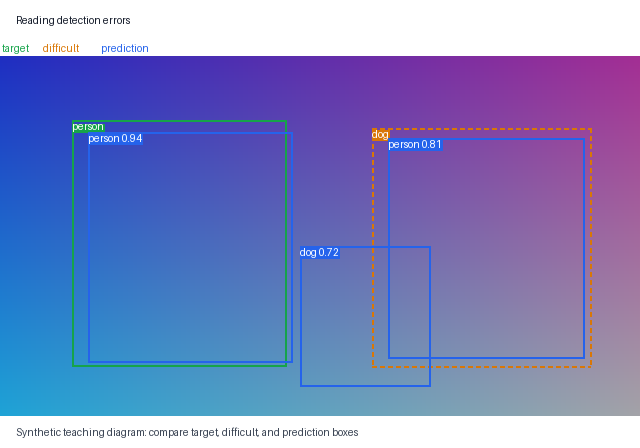

# Tutorial 05: Metrics, Error Evidence, and Inference

[Simplified Chinese](05-evaluation-and-inference.zh-CN.md) | [Tutorial index](README.md)

You need a project checkpoint from Chapter 04. Dataset evaluation also needs the
prepared manifests and source data whose identity matches the checkpoint.
Single-image or directory prediction needs only the checkpoint and local images.

## IoU thresholds and score thresholds answer different questions

IoU measures geometric overlap. A match threshold such as `0.5` asks whether a
same-class predicted box overlaps a target enough to count as a match. A score
threshold asks whether model confidence is high enough to serialize, display, or
analyze a prediction. Raising the score threshold can remove both false
positives and true positives; it does not improve the geometry of remaining
boxes.

The evaluation command's `--score-threshold` filters serialized predictions and
rendered evidence. It does not filter predictions sent to the AP/AR backend. The
separate checkpoint configuration values `error_score_threshold` and
`error_iou_threshold` control error classification.

## Read AP and AR as curves, not one box decision

- `map_50_95` averages Average Precision over IoU thresholds 0.50 through 0.95
  in increments of 0.05. It rewards both classification and tighter localization.
- `map_50` and `map_75` report AP at fixed IoU thresholds.
- `mar_1`, `mar_10`, and `mar_100` report Average Recall with at most 1, 10, or
  100 detections per image.
- `per_class.csv` reports `map_50_95` and `mar_100` for represented foreground
  classes.

AP summarizes a precision-recall curve formed by score-ranked detections. AR asks
how much target evidence is recovered under a detection cap. Neither number says
why an individual image failed, so the evaluator writes both aggregates and
image-level evidence. Backend negative sentinel values are normalized to zero;
serialized JSON/CSV values are rounded to six decimals.

## Difficult targets do not become ordinary errors

Validation and test targets retain VOC difficult objects as `iscrowd=1`.
Ordinary target counts exclude them. During error analysis, a same-class
prediction that overlaps only a difficult target at the configured IoU is marked
`ignored`, not a false positive, and difficult targets are not reported as
missed. This is why dropping `iscrowd` before evaluation changes the meaning of
the report.

## Evaluate validation while making choices

While choosing epochs, thresholds, models, or hyperparameters, evaluate the
validation split:

```bash
uv run detect evaluate --checkpoint artifacts/first-detector/best.pt --split valid --output-dir artifacts/first-detector/evaluation-valid --device cpu
```

Expected stdout prints the output directory. The command rejects a checkpoint
whose manifest identity differs from current prepared data, rebuilds the model
with `weights=none`, loads saved state, and atomically writes:

```text
evaluation.json
predictions.json
per_class.csv
errors.csv
visualizations/summary.png
visualizations/missed-*.png              when missed cases exist
visualizations/false_positive-*.png      when false positives exist
```

`evaluation.json` records metrics, thresholds, backend versions, split, manifest
identity, and checkpoint SHA-256. `predictions.json` is the score-filtered
per-image output. `errors.csv` identifies `missed`, `false_positive`,
`localization`, and `ignored` cases with class, score, IoU, and box.

The output directory must be empty or absent unless `--overwrite` is explicit.
Do not add `--overwrite` until existing evidence has been preserved.

## Return from rows to images

Start with `visualizations/summary.png`, then open ranked missed and
false-positive images beside `errors.csv`. Error analysis first keeps predictions
at or above the error score threshold and processes them from highest to lowest
score. Each prediction considers only unmatched ordinary targets of the same
class. IoU at or above the error IoU threshold consumes one ordinary target as a
match. Otherwise, a sufficient same-class difficult overlap is `ignored`; a
positive overlap with an unmatched ordinary target is `localization`; and the
remaining prediction is `false_positive`. A consumed ordinary target is no
longer a candidate, so a duplicate prediction can become a false positive. After
all predictions, unmatched ordinary targets become `missed`; difficult targets
never do.

Green boxes are ordinary targets, dashed orange boxes are difficult targets, and
blue boxes are predictions. The legend is demonstrated in this synthetic
teaching image, not in a claimed model result:



Use the CSV to find a case and the PNG to form a hypothesis. A metric alone
cannot distinguish small-object misses, class confusion, poor localization, or
duplicate/background predictions.

## Predict from the checkpoint without YAML or dataset manifests

For one local image:

```bash
uv run detect predict --checkpoint artifacts/first-detector/best.pt --image docs/assets/detection-target-anatomy.png --output-dir artifacts/prediction --device cpu --score-threshold 0.5
```

Expected outputs are `artifacts/prediction/detection-target-anatomy.json` and
`artifacts/prediction/detection-target-anatomy.png`. The input is a synthetic
teaching diagram; running a detector on it verifies checkpoint restoration,
inference, and artifact writing, not detection quality. The JSON contains image
dimensions, manifest identity, and every detection at or above the score
threshold. `--display-limit` limits boxes drawn in the PNG after score filtering;
it does not truncate the JSON detections.

For a directory, use `--input-dir` instead of `--image`. The command writes
`predictions.json` plus a `visualizations` tree and records unreadable images as
errors while processing supported `.jpg`, `.jpeg`, and `.png` files. Prediction
reconstructs model architecture and ordered class names from the checkpoint with
`weights=none`; no config YAML or VOC files are needed.

## Keep validation and test roles separate

Use validation to choose the checkpoint and operating thresholds. Once those
choices are fixed, one final official-protocol report may evaluate test:

```bash
uv run detect evaluate --checkpoint artifacts/first-detector/best.pt --split test --output-dir artifacts/first-detector/evaluation-test --device cpu
```

For the bounded learning checkpoint, this still evaluates only the configured
test limit and is not a complete VOC score. Repeatedly looking at test and then
changing the model turns test into another validation set.

## Compare compatible runs without erasing context

After two runs on the same immutable manifest identity:

```bash
uv run detect compare-runs artifacts/experiment-a artifacts/experiment-b --metric valid_map_50_95 --output artifacts/comparison.csv
```

Expected stdout names the metric and shared manifest identity, ranks each run by
its best metric row, and lists semantic configuration differences. The report
intentionally excludes the operational fields `run_name`, `output_dir`, `device`,
and `data.num_workers`. Loss metrics are ordered lower-first; other metrics
higher-first. The command rejects missing artifacts/columns, non-finite values,
differing manifest identities, and an existing output CSV. A ranking compares
these recorded runs only; it does not prove that one configuration is universally
better.

## Common failure boundaries

- Checkpoint and prepared-data identities differ: evaluation stops; prediction
  may still run because it does not claim dataset metrics.
- `evaluation-*` already contains files: choose a new directory or deliberately
  preserve and overwrite it.
- Metrics look unchanged after raising `--score-threshold`: expected, because
  that CLI threshold is not applied to the AP/AR backend.
- Difficult matches appear as ordinary false positives: verify `iscrowd` was
  preserved through the target path.
- JSON has more detections than the PNG: `--display-limit` is visualization-only.
- A bounded test score is presented as complete VOC evidence: the evidence scope
  is wrong, regardless of the numeric value.

Return to the [learning path](learning-path.md) for a complete workflow audit, or
use the [metrics reference](../reference/metrics.md) when reading report fields.
