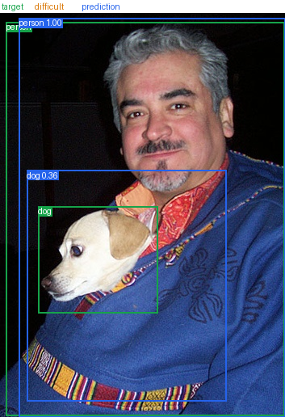

# 教程 05：读懂评估结果与预测

[English](05-evaluation-and-inference.md) | [教程索引](README.zh-CN.md)

你可以直接使用仓库保存的 Kaggle 结果学习这一章，不需要先下载 145 MB checkpoint。
从 [`../recorded-run/evaluation`](../recorded-run/evaluation) 目录开始。

## 先看汇总结果

[`evaluation.json`](../recorded-run/evaluation/evaluation.json) 记录了全部 4,952 张 VOC 2007
测试图像的评估：

| 指标 | 已完成的 Kaggle 结果 |
|---|---:|
| `map_50_95` | **0.322312** |
| `map_50` | **0.609917** |
| `map_75` | 0.302681 |
| `mar_100` | 0.415008 |

这些值是 0 到 1 的小数，不是百分数。`map_50_95` 同时要求类别正确和边界框较准确，通常
比只使用 IoU 0.5 的 `map_50` 更低。

## mAP 在衡量什么

一个预测要与标注类别相同，并达到指定 IoU 才算匹配。IoU 是两个框交集面积与并集面积
之比。

- `map_50`：固定使用 IoU 0.5。
- `map_75`：固定使用更严格的 IoU 0.75。
- `map_50_95`：对 0.50、0.55、...、0.95 十个阈值的 AP 求平均。
- `mar_100`：每张图最多保留 100 个预测时的平均召回率。

AP 会综合不同置信度阈值下的 precision 和 recall，所以不能用一张图或一个分数阈值代替。

## 查看各类别差异

打开 [`per_class.csv`](../recorded-run/evaluation/per_class.csv)。它为 VOC 的 20 个类别分别
列出 `map_50_95` 和 `mar_100`。类别差异可能来自目标大小、遮挡、外观变化、数据数量和
类别混淆。

先找最好和最差的几个类别，再到 `errors.csv` 和图像中寻找具体原因。不要仅根据类别 AP
猜测模型“懂”或“不懂”某个物体。

## 从错误记录回到图像

[`errors.csv`](../recorded-run/evaluation/errors.csv) 包含四类记录：

- `missed`：普通标注没有被任何合格预测匹配。
- `false_positive`：预测没有匹配同类别普通目标。
- `localization`：类别可能正确，但框重叠没有达到阈值。
- `ignored`：预测只匹配 difficult 目标，不计为普通误检。

先看真实汇总图：



绿色框是普通标注，橙色虚线是 difficult 目标，蓝色框是预测。接着查看：

- [一个误检案例](../recorded-run/evaluation/visualizations/false_positive-01-009040.png)
- [一个漏检案例](../recorded-run/evaluation/visualizations/missed-01-006500.png)

一张图不能代表整个测试集，但能帮助你提出下一步问题：是小目标、遮挡、类别混淆、框偏移，
还是重复预测？再回到 CSV 查看类别、分数和 IoU。

## difficult 目标为什么单独处理

VOC 的 difficult 目标通常难以可靠识别或定位。它们不会计入普通目标总数，也不会被标记为
漏检。只匹配 difficult 目标的预测会记为 `ignored`，而不是 `false_positive`。

这也是数据加载时需要保留 `difficult` / `iscrowd` 信息的原因。

## 验证集和测试集的分工

训练过程中使用 valid：

- 比较 epoch。
- 选择 `best.pt`。
- 调整模型和超参数。

全部选择完成后，才使用 test 生成一次最终报告。已发布运行在第 18 轮取得最佳验证指标，
完成 26 轮后才评估测试集。反复看测试结果再改模型，会让测试集失去独立性。

## 使用你下载的 checkpoint 预测

如果已经从 Kaggle 下载 `best.pt`，可以预测一张本地图像：

```bash
uv run detect predict --checkpoint kaggle-output/reference-fasterrcnn/best.pt --image image.jpg --output-dir artifacts/prediction --device cpu --score-threshold 0.5
```

输出目录中会有同名 JSON 和 PNG。JSON 保存完整浮点框、类别和分数；PNG 方便快速查看。
`--score-threshold` 越高，显示的低置信度预测越少，但它不会重新训练或改善框的位置。

预测整个目录：

```bash
uv run detect predict --checkpoint kaggle-output/reference-fasterrcnn/best.pt --input-dir images --output-dir artifacts/predictions --device cpu --score-threshold 0.5
```

预测只需要 checkpoint 和图像，不需要 VOC 数据。CPU 可以完成推理，只是速度比 GPU 慢。

## 重新评估自己的 Kaggle 结果

Kaggle runner 已自动评估 test。只有在需要不同可视化分数阈值或重新生成文件时，才需要在
准备好匹配 VOC 数据的环境中再次运行评估命令。详细参数见
[指标参考](../reference/metrics.zh-CN.md)。

到这里，你已经走完从边界框到 Kaggle 训练再到错误分析的主线。下一步可以选择
[比较配置](../guides/experiments.zh-CN.md)、[更换模型](../guides/using-models.zh-CN.md)或
[使用自己的数据](../guides/using-your-data.zh-CN.md)。
